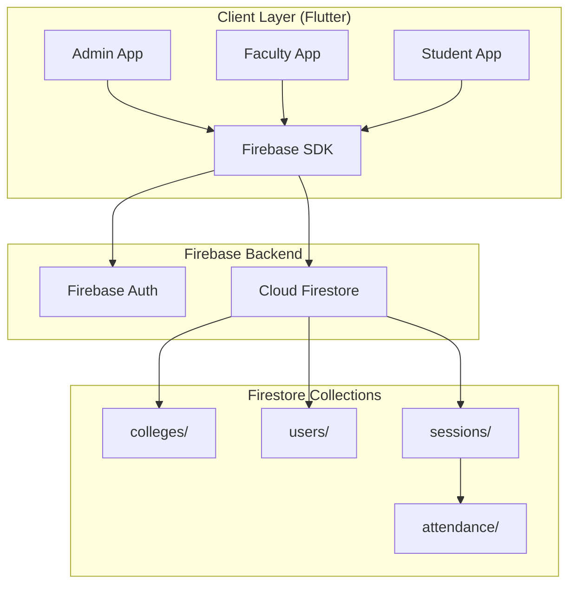

# 📱 Smart Attendance System


A cross-platform mobile and web application built using **Flutter and Firebase** that automates the process of attendance tracking in educational institutions. 

This modern system replaces manual, error-prone roll-call methods with a highly secure, **dynamic QR-code-based attendance mechanism** backed by cryptographic **HMAC-SHA256 time-rotating tokens**.

---

## 🌟 Key Features

### 🔒 Bank-Grade Security (Anti-Proxy)
- **Time-Rotating Tokens:** Faculty devices generate dynamic QR codes that refresh every 2 minutes.
- **HMAC Cryptography:** Each token is signed with an HMAC-SHA256 digest ensuring total unforgeability.
- **Duplicate Prevention:** The database strictly prevents students from scanning the same session twice.

### 🏫 Multi-Tenant Architecture
- Supports multiple independent colleges operating seamlessly on the same platform.
- Complete data isolation: Admins from one college cannot access data from another.

### 👨‍🏫 Role-Based Dashboards
* **Admin Dashboard:** Setup the structural hierarchy (Programs, Classes, Subjects). Assign faculty and manage a rich Drag-and-Drop Timetable.
* **Faculty Dashboard:** View assigned classes, start/end live sessions instantly, and monitor real-time attendance streams as students scan the QR code.
* **Student Dashboard:** Scan live sessions securely via the mobile camera, or enter tokens manually on the web fallback.

### ⚡ Real-Time Synchronization
* Everything is hooked up to **Firebase Cloud Firestore** streams. When a student scans a code, the faculty member's attendance count increments instantly on their screen.

---

## 🏗️ System Architecture

The project is built on strict **Clean Architecture** principles and utilizes **Riverpod** for robust, testable state management.



---

## 🛠️ Technology Stack

| Technology | Layer | Purpose |
|---|---|---|
| **Flutter 3.x** | Framework | Cross-platform UI compilation (Web, Android, iOS) |
| **Dart 3.x** | Language | Core application logic |
| **Riverpod (2.6+)** | State Management| Reactive state, caching, and Dependency Injection |
| **GoRouter** | Routing | Declarative deep-linking and auth-aware redirects |
| **Firebase Auth** | Authentication | Identity management via Google Sign-In |
| **Cloud Firestore**| Database | Real-time NoSQL data synchronization |
| **Freezed** | Code Generation | Immutable data modeling & JSON serialization |
| **mobile_scanner** | Hardware | Native camera-based QR scanning |
| **qr_flutter** | Rendering | Secure dynamic QR code rendering |
| **crypto** | Security | HMAC-SHA256 token generation |

---

## 🚀 Getting Started

### Prerequisites
- [Flutter SDK](https://flutter.dev/docs/get-started/install) (latest stable version)
- A Firebase Project with **Firestore** and **Google Authentication** enabled.

### Run Locally

1. **Clone the repository:**
   ```bash
   git clone https://github.com/VashimSipai/Smart_Attenedance_App.git
   cd Smart_Attenedance_App
   ```

2. **Install Dependencies:**
   ```bash
   flutter pub get
   ```

3. **Code Generation:**
   *(Run this if you modify any `*.freezed.dart` or `*.g.dart` models)*
   ```bash
   dart run build_runner build -d
   ```

4. **Run the App:**
   ```bash
   flutter run
   # Or for web: flutter run -d chrome
   ```

---

## 🔮 Future Enhancements (Roadmap)
- [ ] **Attendance Reports & Analytics:** CSV exports and visual charts for subject-wise attendance percentages.
- [ ] **Push Notifications:** Alerts for low attendance and session reminders via FCM.
- [ ] **Geo-Fencing:** Validate that the student's location is actually within campus boundaries when scanning.
- [ ] **Email/Password Auth:** Provide fallback login methods for users without Google accounts.

---

*For an in-depth dive into the research, project timeline, and deeper systems analysis, please refer to the `PROJECT_DOCUMENTATION.md` file.*
